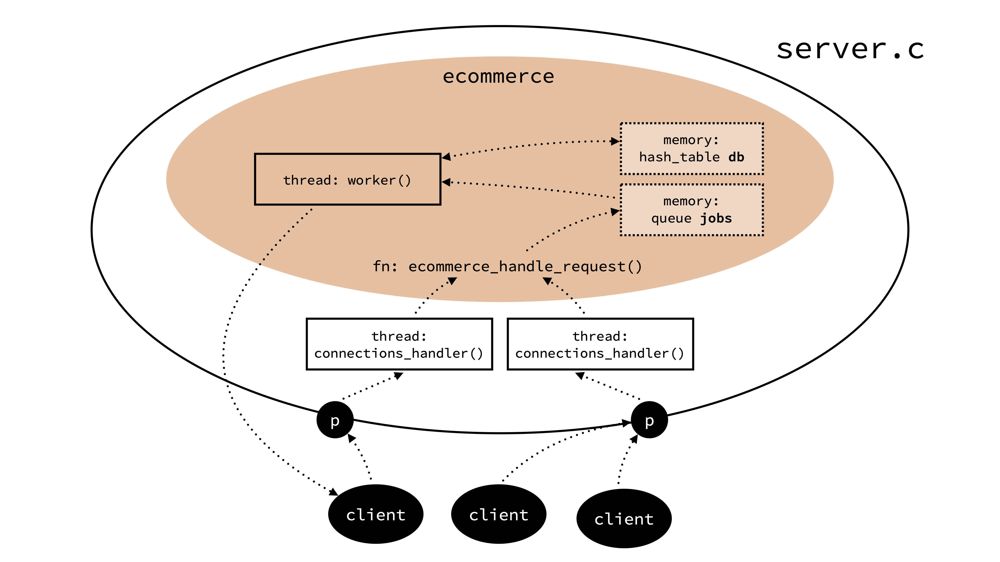

# Report

**e-commerce project** in **Operating Systems / Spring 2020**

Group members:

- Albin Aliu
- Hans-Andrea Danuser
- Christoph Jutzet
- Andrea Tettamanti

## Introduction
The goal of this project was to implement a classical  Key-Value store in C. The connection between the server and the client (either customer or shop owner) should be established through a TCP connection. Finally, the server should be multi-threaded, to take advantage of multi-core CPUs.

## Approach
From the beginning, we wanted to make the needed modules as independent as possible. And that's what we did. The `server.c` is an implementation of multiple (mostly) independent modules: 

- `queue`: As the name suggests, it's a simple queue implementation. Whenever our server receives a new message, the message is validated and put into the queue.
- `networking`: This module handles the networking part. Basically, it's just one rather large function, which enables the server to receive messages through TCP.
- `hash_table`: This is an implementation of a hash table which even handles collisions using chaining (linked lists).

These are the three independent modules. All of these modules can be used independently, please see the documentation inside the module folder for usage information.

Finally, the e-commerce store implementation happens inside the `ecommerce` module. The `server.c` file basically asks you to implement some functions like `handle_request()`, `custom_programs_initialize()`, `custom_programs_terminate()`, and maybe `kill_server()`. The implementation of these function happens inside `ecommerce`. One could say that the ecommerce module is kind of an overlay for the server, which makes everything tidy, neat and clean. 

## How does it work

Knowing now each module, one can easily figure out what we're actually doing:

- The server open $n$ many sockets on $n$ different ports. This can be configured inside `config.h`. The server will create a thread for every socket and start listening on that socket. Once a thread receives a message, the message will be handled by the `handle_request()` function defined inside of `server.c`. As mentioned earlier, this function now passes the contents to the ecommerce module, namely function `ecommerce_handle_request()`, to keep everything tidy and neat. 

- The `ecommerce_handle_request()` module will validate the message, i.e. if the message is some valid server action, like e.g. `ADD item:str amount:int` or `BUY item:str amount:int`. If it's a valid message, the message will be enqueued into our queue. 

And that's the first part. Of course, enqueuing and dequeuing is mutex locked. Thus only one thread at a time can access the queue. 

The second part is about working on queue: 

The server spawns currently one worker thread, but one can define even multiple worker threads! These worker threads will work on the queue, dequeuing the elements and doing the work, e.g. adding items, buying items, getting items, etc. Once the work is done, in most cases, the server will send back a message to the client (be it a customer or a shop owner). The server uses the hash table to store and update the keys (items) and their corresponding value (amount). 

This seperation of getting work and doing work on multiple threads allows (or that's what we think and suppose) for the server to be more efficient. 

## Stress Testing
We tested the server with up to 1'000 connections. It worked pretty good! However, some messages were lost and we know the cause. The problem is, that we didn't take the segmentation of TCP packets into account. Thus this needs to be updated, and that's what we'll try to do until tomorrow for the presentation. Otherwise, every scenario works like a charm. See programs inside  the `scenario` folder. 

## Additional features/Scenario 3
As mentioned in the requirements, we need to implement an additional feature or more complex architecture. We did both!

- The ecommerce is basically just an overlay on the server. One can easily just replace and rewrite the needed functions and handle the received data in any other way. This makes the server very versatile. 
- The server state (database of key-value pairs) can be permanently stored
- The `hash_table` module is a complete hash table implementation which handles collisions with chaining. It's also very versatile, since one can store any kind of data type as a value.
- The `networking` module is a neat shortcut that can be indepdently used to open a standard TCP socket. 
- Exstensive documentation and usage examples

## Conclusion

We are very happy with the results. By following the philosophy of trying to develop the modules independently, we got some nice byproducts one can use for other stuff. The `hash_table` for example will work on (we tried `int` and `char*`) any kind of types, since it's basically just `memcpy()`ing the given data. Now, we just need to fix the segmentation problem which appears if you have multiple hundreds of connections and we're good to go.